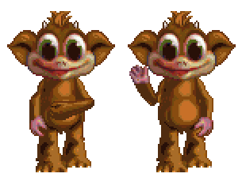

# Creature's Breed Util
Command line tool for handling breed conversions and appearance gene alterations for the Creatures games

**Table of Contents**
<!-- TOC -->
* [Creature's Breed Util](#creatures-breed-util)
  * [Basic Information](#basic-information)
    * [Install](#install)
    * [Breed Convert: TL;DR;](#breed-convert-tldr)
      * [Windows](#windows)
      * [MacOS](#macos)
      * [Linux](#linux)
  * [Base Commands](#base-commands)
  * [Command Line Basics](#command-line-basics)
    * [Input Files: Paths](#input-files-paths)
    * [Current Working Directory](#current-working-directory)
    * [Arguments](#arguments)
    * [Options](#options)
      * [Regular Options](#regular-options)
        * [Flags](#flags)
  * [Convert-Breed](#convert-breed)
    * [Special Conversion Options](#special-conversion-options)
      * [Progressive Arms](#progressive-arms)
      * [Missing Tails:](#missing-tails)
      * [Altering Genome Breed](#altering-genome-breed)
    * [Breed Conversion: Easy Way](#breed-conversion-easy-way)
    * [Breed Conversion - Manual Way](#breed-conversion---manual-way)
      * [Conversion Options](#conversion-options)
        * [Game Variant](#game-variant)
        * [Genus](#genus)
  * [Alter-Genome](#alter-genome)
    * [Usage](#usage)
  * [Appendix: macOS](#appendix-macos)
    * [Open Terminal](#open-terminal)
      * [Open Terminal From Spotlight](#open-terminal-from-spotlight)
      * [Open Terminal Through Finder](#open-terminal-through-finder)
    * [GATEKEEPER](#gatekeeper)
      * [Allow Program in Terminal](#allow-program-in-terminal)
      * [Allow Program in System Setting](#allow-program-in-system-setting)
  * [Appendix: Windows](#appendix-windows)
    * [Open CMD (command line window)](#open-cmd-command-line-window)
<!-- TOC -->

## Basic Information

This is a command line program, and must be run from the CMD program on Windows or terminal on unix.  
**Be aware of your [current working directory]** as all non-absolute paths will be relative to it.

--------

### Install

1. Navigate to the [Breed Util Releases](https://github.com/bedalton/creatures-breed-util/releases) page on GitHub
2. Download the most recent release for your OS
    - Windows (x64)
    - MacOS (x64) - 64-bit Macs (or Arm64 Macs with Rosetta)
    - MacOS (arm64) - Arm64 Macs using an arm based terminal
    - Linux (x64) - 64-bit linux *Compatability is Unknown*
    - Linux (Arm64) - Arm64-bit linux - *Compatability is Unknown*
3. Extract the contents and copy the binary/exe to the folder of your choosing.
4. (Optional) Add this directory to your PATH variable, so it can be referenced from anywhere

Executable can be referenced by absolute path or relative path if not added to the system PATH variable.

**Node version** is deprecated and not receiving updates

----------

### Breed Convert: TL;DR;

**Progressive Arms** (`--progressive`) - use side arm sprites to mimic front arm sprites.
See [Progressive Arms](#progressive-arms) section   
**Same Size** (`--same-size`) - make all sprites in a single file the same size  
-*This may prevent crashes some people experience with conversions*

#### Windows

1. Double click `breed-util.exe`,
2. Follow prompts  
   \- Answering `y`/`yes` or `n`/`no` to yes/no questions  
   \- Drag in a single folder or a single file when asked  
   \- For output genome you will want to drag in the output folder and add a forward-slash and type in the file name
3. Press enter when finished

#### MacOS

1. [Open Terminal](#open-terminal)
2. Drag the downloaded binary `breed-util` into finder
3. Press Enter
    - If macOS does not allow it to run see [Gatekeeper](#gatekeeper)
4. Follow prompts  
   \- Answering `y`/`yes` or `n`/`no` to yes/no questions  
   \- Drag in a single folder or a single file when asked  
   \- For output genome you will want to drag in the output folder and add a slash and type in the file name

#### Linux

1. Open a Terminal window
2. Run `breed-util ask` with any desired arguments and options  
   \- Options not set initially, will be prompted for answers
3. Follow prompts     
   \- Answering `y`/`yes` or `n`/`no` to yes/no questions  
   \- Drag in a single folder or a single file when asked  
   \- For output genome you will want to drag in the output folder and add a slash and type in the file name

-----

## Base Commands

The `breed-util` utility allows for the following sub-commands:

**[ask](#breed-conversion-easy-way)** - Question and answer based breed conversion

**[convert-breed](#convert-breed)** - Convert a breed's images (and optionally its ATTs) from one game to another

**[alter-genome](#alter-genome)** - Alter the appearance genes of Creatures genome

```
Usage: 
    breed-util ask
    breed-util convert-breed {target-game} [options_list] {inputFiles...}
    breed-util alter-genome [options_list]
    
Subcommands: 
    ask - Guided conversion of a breed using quesions/prompts
    convert-breed - Convert breed files between game formats
    alter-genome - Alter appearance genes in a Creatures genome

Options: 
    --help -> 
        Usage info for base command `breed-util --help`, 
        or child command. i.e. `breed-util convert-breed --help`
```

--------

## Command Line Basics

### Input Files: Paths

Paths can be relative to the [current working directory](#current-working-directory) or absolute.  
On windows paths are separated with `\\`. When viewing examples, keep this in mind

Any time a file or folder is needed, you may drag one into the command line window

### Current Working Directory

**Current working directory** is the path your terminal or Command Prompt thinks you are.

- Usually when starting a command prompt or terminal, this is your **HOME** directory
- **This is not usually the folder you have open** or are viewing when you open the command prompt.
- To Navigate to the folder you want, us `cd ` (plus a space)
    - then enter/paste the absolute path to the folder
        - `c:/MyFolder` or `"/Users/{myname}/My Folder"`
    - **drag** the folder from explore,finder, etc. into the CMD or Terminal window
    - If typing in a folder with a space, surround it with quotation marks

### Arguments

Arguments are values that are defined by their position.  
They do not use a prefix they are simply used.   
In this README, they will be surrounded by `{` and `}`  
i.e. `breed-util convert-breed {game-target}`

- `breed-util convert-breed` is entered as is,
- `{game-target}` must be substituted by the target game
- Example: `breed-util convert-breed C2`

### Options

come after the `breed-util` command and its subcommand, and come in two flavors

#### Regular Options

Most options are followed by a value i.e. `--input-genus norn`.

- Here the *option* is `--input-genus` and the *value* is `norn`

##### Flags

Flags take **no arguments**, and represent a **true** value to the flag

- Flags take no argument so do not put `yes` or `no` after it
- **Using a flag** = **true**; Presence of a flag, means that value is true or enabled
- **No flag** = **false**; Absence of flag means that value is false

---

## Convert-Breed

Converts a breed's sprites from one game to another and optionally its ATTs as well

For C1 to/from C2 or C2e conversions, the tail parts are
automatically reversed as is needed for C1 tails to the other games and vice-versa

**Note:** This utility does **not** support **Creatures Village/Adventure** in any direction

### Special Conversion Options

#### Progressive Arms

C1/C2 breeds only have one front facing pose, so when converted, norns will appear to stare straight at the camera while
not moving.

"Progressive arms" adds front facing arm poses for C1/C2 conversions to C3DS. It does so using the side views of the
arms.  
**Note:** Manual editing of the combined arm ATTs may be necessary



#### Missing Tails:

*Empty tail sprite and ATTs will be generated automatically* if the C1 breed does not have one defined

#### Altering Genome Breed

Optionally an existing genome for the target game can have its appearance genes altered  
Genome alteration also **alters the sleep pose** between C1e and C2e conversions

- This prevents creatures from sleeping/dying standing up

*\*note:* This program does not convert a genome, it simply alters an existing genome for the target game       
*i.e. If converting to C3, you must supply an existing C3 genome. **No conversion is done between games***

### Breed Conversion: Easy Way

**\*Convert Through Prompts***

Using the command line can be daunting, so running `breed-util` without arguments or with subcommand `breed-util ask`
will allow you to convert a breed by answering questions and providing files  
*On **windows** you can double-click the EXE to start the breed conversion prompts*

```SHELL
$: breed-util
# OR
$: breed-util ask
```

When running the easy way, you will be asked questions.   
Some ask for `yes`/`y` or `no`/`n`
or may ask for a file or folder to files see [paths](#input-files-paths).  
Paths can be relative to the **current working directory** (see [current working directory](#current-working-directory)) or absolute.  
Simplest way is to drag the folder or file into the command terminal

Answer questions and provide files when requested, pressing enter after answering each request

Some questions can be skipped if you use command line options and arguments and the `breed-util ask` subcommand  
See [Conversion Options](#conversion-options)

**To cancel** us `CTRL+C`

### Breed Conversion - Manual Way

The manual way can speed up conversions, if you are familiar with the options you will use.  
Many of these options can be used with the [easy way](#breed-conversion-easy-way) as well, saving time

`breed-util convert-breed {target-game} [..options] {input sprite files}`

- `{taget-game}` - The game to convert to \[C1,C2,C3]
    - *No conversion to/from Creatures Village*
- `[..options]` *see the [Options](#options) section for options and definitions*
- `{files}` - Any sprite files needed for the conversion.
    - Can be a sprite folder or folders
    - File paths in quotes separated by spaces
    - *see [Input Files](#input-files-paths)*
- `--help`, `-h` -> Print help information about arguments and options
    - Use as`breed-util --help` or `breed-util -h` without arguments or options.

#### Conversion Options

##### Game Variant
- C1
- C2
- C3

##### Genus
- **n**\[orn]
- **g**\[rendel]
- **e**\[ttin]
- **s**\[hee] / **geat**  
\*Note* Remember, ***g* is grendel** not geat

| Option                  | Argument                                       | Descriptions                                                                                          |
|-------------------------|------------------------------------------------|-------------------------------------------------------------------------------------------------------|
| `{target game}`         | [Game Variant](#game-variant-c1c2-c3)          | Game to convert breed to \[C1,C2,C3\]                                                                 |
| `--from`                | [Game Variant](#game-variant-c1c2-c3)          | Input sprite's game variant \[C1,C2,C3\]                                                              |
| `--encoding`, `-c`      | \[555, 565\]                                   | Color encoding                                                                                        |                                                                                                       |
| `--genus`, `-g`         | [genus](#genus---norn-grendel-ettin-shee-geat) | The output breed sprite genus                                                                         |
| `--breed`, `-b`         | A-Z or 0-9                                     | The output breed slot for these breed files                                                           |
| `--input-genus`         | [genus](#genus---norn-grendel-ettin-shee-geat) | The genus to filter input files by                                                                    |
| `--input-breed`         | A-Z or 0-9                                     | The breed to filter input files by                                                                    |
| `--force`, `-f`         | [*\[flag\]*](#flags)                           | Force overwrite of existing files                                                                     |
| `--progressive`         | [*\[flag\]*](#flags)                           | Create front facing arm sprites from side arm sprites <br/> see [Progressive Arms](#progressive-arms) |
| `--keep-ages`           | [*\[flag\]*](#flags)                           | Do not shift ages to match target game                                                                |
| `--samesize`, `-z`      | [*\[flag\]*](#flags)                           | Make all frames in a body part the same size                                                          |
| `--no-tail`             | [*\[flag\]*](#flags)                           | Do not create tail files (even if none are present)                                                   |
| `--progress`, `-p`      | [*\[flag\]*](#flags)                           | Output file conversion progress                                                                       |
| `--att-dir`, `-a`       | [Input Folder](#input-files-paths)             | The location of atts to convert if desired                                                            |
| `--output`, `-o`        | [Output folder](#input-files-paths)            | Output folder for the converted breed files                                                           |
| `--input-genome`        | [Genome file](#input-files-paths)              | Input genome file to alter appearance genes for                                                       |
| `--output-genome`       | [File path](#input-files-paths)                | Altered genome output file path                                                                       |
| `--skip-existing`, `-x` | [*\[flag\]*](#flags)                           | Skip existing files                                                                                   |
| `--ignore-errors`, `-e` | [*\[flag\]*](#flags)                           | Ignore all compilation errors. <br/> Other errors will still cancel compile                           |
| `--quiet`, `-q`         | [*\[flag\]*](#flags)                           | Silence non-essential output                                                                          |

**# Example 1: Convert a breed "simple"**  
The following would convert a breed's sprites to C3, keeping the genus, age and breed slot the same

```console
breed-util convert-breed C3 Images/*0*8.spr Images/*4*8.spr
```

**# Example 1: Change slot**  
The following code would produce a C3 compatible breed sprites in `ettin slot z` from a `norn slot 8`

```console
breed-util convert-breed C3 --genus ettin --breed z Images/*0*8.spr Images/*4*8.spr
```

**# Example 3: Convert ATTs**  
To convert ATTs in addition to sprites, use the `--att-dir, -a` option followed by the ATT directory
So to convert a `norn slot 8` breed from C1 to C3 `ettin slot z` you would use:

```console
breed-util convert-breed C3 --genus ettin --breed z --att-dir "Body Data" Images/*0*8.spr Images/*4*8.spr
```

**NOTE** Despite the ATTs being converted automatically.
Care should be taken to edit head and body ATTs converted from C1/C2 as the
tail, hair and ear positions will be set to `0,0`. This will be very noticeable when bred with other breeds

**# Example 4: Without tail**  
The prior commands will produce tail sprites (and atts if --att-dir is set)
by default if one does not exist for the breed.  
To prevent this, use the `--no-tail` flag.  
The following would produce norn sprites and ATTs for parts `a` to `l`, but not `m` or `n`.

```console
breed-util convert-breed C3 --genus ettin --breed z --no-tail --att-dir "Body Data" Images/*0*8.spr Images/*4*8.spr
```

**# Example 5: Remap a breed**  
You can technically remap a breed by passing in the same game as the one it is for, but with different slot
information  
The following would create a copy of norn slot `a` into ettin slot `z`;
** Be sure to include the `--att-dir` flag or the body data will not be remapped

```console
breed-util convert-breed C3 --genus ettin --breed z --att-dir "Body Data" Images/*0*a.c16 Images/*4*a.c16
```  

---------

## Alter-Genome

The alter genome command, alters a genome's appearance genes.
This allows you to set different genus/breeds per part

Appearance genes follow the format: `{genus}:{breed}`.   
Genus can be `norn` or `n`, `grendel` or `g`, `ettin` or `e`, `geat` or `shee` or `s`.  
**NOTE:** The shorthand for GEAT is '**S**' not 'G'. **'G' is for Grendel only**

```
Arguments: 
    input-genome -> The genome to alter { String }
    output-genome -> Altered genome output file path { String }
Options: 
    --genome-genus -> The genus of the creature, separate from appearance.
    --alter-sleep, -s [flag] -> Alter sleep/death pose for C1e to C2e conversions. 
    --force, -f [flag] -> Force overwrite of existing files 
    --skip-existing, -x [flag] -> Skip existing files 
    --help, -h -> Usage info 
Breed: 
    Expected pattern {genus}:{breed};
    i.e. "norn:z" or "n:z"
    --breed, -b -> The breed to use for body parts not overwritten by other options 
    --head -> Breed for head
    --body -> Breed for body
    --legs -> Breed for legs
    --arms -> Breed for arms
    --tail -> Breed for tail
    --hair -> Breed for hair
Color: Value: 0-255; 128 = Default (no tint/swap/rotation applied)
    --red -> Red tint to apply [0..255]
    --green -> Green tint to apply [0..255]
    --blue -> Blue tint to apply { Int }
    --swap -> Color swap between red and blue { Int }
    --rotation -> Color rotation or shifting of red, green and blue channels
```

### Usage

**# Change all parts to same genus/breed**  
To alter a genome to use norn slot for all body parts and save to a new file called `norn.new.gen`, use:

```console
breed-util alter-genome ./norn.existing.gen ./norn.new.gen--breed n:a 
```

**# Change head only**
To change only the head to a new file called `norn.new.gen`, use:

```console
breed-util alter-genome ./norn.existing.gen ./norn.new.gen --head n:a
```

**# To Change Colors
To change the tint of a genome and save it to a file called `norn.new.gen`, use:
```console
breed-util alter-genome ./norn.existing.gen ./norn.new.gen --tint 10:10:255
```

**# To change swap and rotate
To change swap and rotate (which can be used independently of each other) use:
```console
breed-util alter-genome ./norn.existing.gen ./norn.new.gen  --swap 20 --rotation 20
```

## Appendix: macOS

### Open Terminal

You can open terminal through [spotlight](#open-terminal-from-spotlight) or [Finder](#open-terminal-through-finder)

#### Open Terminal From Spotlight

1. Open Spotlight
    - Shortcut Key - `CMND+SPACE`
    - OR Click the magnifying-glass icon on the menubar in the upper right
2. Type in `Terminal`
3. Select `Terminal.app` and hit enter
4. \[Optional] Set your current working directory if desired using `cd` (see [current working directory](#current-working-directory))

#### Open Terminal Through Finder

1. Open Finder
2. Open the `Applications` Folder
3. Open the `Utilities` folder
4. Double Click `Terminal.app`
5. \[Optional] Set your current working directory if desired using `cd` (see [current working directory](#current-working-directory))

### GATEKEEPER

MacOS may prevent you from opening the executable as the binary is not signed

#### Allow Program in Terminal

1. copy and paste `xattr -d com.apple.quarantine `
2. Add a space after it
3. Drag the `breed-util` executable into the folder and hit enter
4. Enter password if prompted

#### Allow Program in System Setting

1. Open System Settings
2. On the left side find `Privacy and Security`
3. Find `Security`
4. Click `Open Anyways`
5. Enter Password if prompted

## Appendix: Windows
### Open CMD (command line window)
1. Click the search bar next to the windows icon
2. Type `CMD`
3. Click `Command Prompt`
4. \[Optional] Set your current working directory if desired using `cd` (see [current working directory](#current-working-directory))